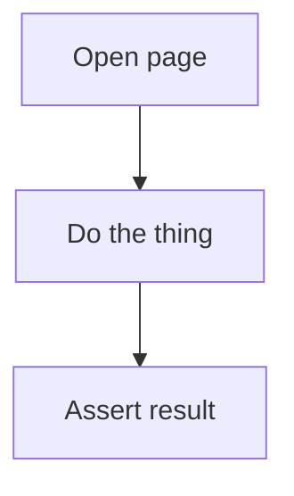

# Usage Guide

## Setup

SiteMapper requires two things running side by side:

- **Claude Code** (CLI, desktop, or web) — reads/writes site maps from this repo, runs skills and workflows
- **Chrome + Claude-in-Chrome MCP extension** — gives Claude Code browser control (DOM reading, clicking, form input, navigation)

You type commands in Claude Code. Claude controls the browser through the MCP extension. The site maps live on your file system, not in the browser.

To begin, tell Claude to open a Chrome browser session (it creates its own tab via the MCP extension) and navigate to your target URL — you don't open the tab by hand. Make sure Chrome and the Claude-in-Chrome extension are running first, and that you're logged in to the target site if it requires auth (Claude won't enter credentials for you).

## Mapping a Site

1. In Claude Code, run `/map-site <site-name>` (e.g., `/map-site sitemapper-demo`).
2. Tell Claude to open a Chrome browser session and navigate to the target URL (Claude opens its own tab through the MCP extension — you don't open it by hand).
3. The discovery agent reads the page, suggests elements, and asks you to confirm or correct.
4. Walk through each page — the agent writes YAML maps as you go.
5. When done, the agent updates `sites/<site>/site.yaml` with the full page list.

The output is a directory under `sites/`:

```
sites/<site-name>/
  site.yaml           # Base URL, auth notes, list of pages and workflows
  pages/
    dashboard.yaml     # One file per page
    settings.yaml
  workflows/
    my-task.yaml       # Site-specific workflows
```

## Writing Workflows

### Site Workflows (single site)

Place in `sites/<site>/workflows/`. A workflow defines a sequence of steps against one mapped site:

```yaml
workflow:
  name: smart-issue
  description: Create a new issue with a smart title
  site: sitemapper-demo

  parameters:
    - name: issue_title
      type: text
      description: Title for the new issue
      required: true

  steps:
    - action: click
      page: issues-list
      element: new-issue-button
      description: Open new issue form

    - action: input
      page: new-issue
      element: title-field
      value: "$issue_title"
      description: Enter issue title

  verify:
    - "Issue created successfully"
```

### Project Workflows (cross-site)

Place in `projects/<project>/workflows/`. A project groups workflows that span multiple sites:

```
projects/<project-name>/
  project.yaml         # Which sites, description
  workflows/
    my-workflow.yaml
```

**project.yaml:**

```yaml
project:
  name: Issue Tracking
  description: Manage issues using the demo issue tracker
  sites: [sitemapper-demo]
  workflows:
    - smart-issue.yaml
```

**Workflow with capture variables:**

```yaml
workflow:
  name: smart-issue
  description: Read existing issues and create a related follow-up
  site: sitemapper-demo

  steps:
    - action: read
      page: issues-list
      element: issues-table
      capture: open_issues
      description: Read current open issues

    - action: input
      page: new-issue
      element: description-field
      value: "Follow-up for: $open_issues"
      description: Create follow-up issue with captured data

  verify:
    - "Issue created with reference to existing issues"
```

The `capture` field stores a step's output in a named variable. Later steps reference it with `$variable_name`.

### Companion doc (`<workflow>.md`)

Every workflow YAML gets a sibling `<workflow>.md` in the same folder — a short,
human-readable summary so anyone can grasp the flow without reading the YAML. The
YAML stays the source of truth; the `.md` is the at-a-glance view. Keep it tight:

- **Title** (the workflow name) and a one-line purpose.
- **At a glance** — site(s), mode, key inputs (parameters/fixtures) → outputs (captures).
- **Flow** — a **Mermaid `flowchart`** of the steps (setup → steps → report). Group
  by site with `subgraph` for cross-site workflows; show loops and branches.
- **See also** — relative links to the `.yaml` and the latest result file.

Example: [`sites/sitemapper-demo/workflows/smart-issue.md`](sites/sitemapper-demo/workflows/smart-issue.md).

Skeleton (outer fence shown with `~~~` so the inner Mermaid fence is literal):

~~~markdown
# my-workflow

One-line purpose.

**At a glance** — Site: my-site · Mode: deterministic · In: $param → Out: capture_x

## Flow

~~~

## Running Workflows

```
/run <workflow-name>
```

The runner searches both `sites/*/workflows/` and `projects/*/workflows/`. It collects parameters (dropdown for select, prompt for text), executes steps via Chrome MCP tools, and reports results.

## Listing Workflows

```
/list-workflows              # all workflows
/list-workflows sitemapper-demo   # site-specific only
```

## Checking for Drift

```
/verify-map <site-name>
```

Navigates to each mapped page and checks whether elements still exist. Reports found/missing per page.

## Map Format

Maps use semantic locators in order of preference:

1. `data-testid` — most stable (add to your app if you control it)
2. `aria-label` — accessibility attributes
3. `text` — visible text content
4. `role` — ARIA roles
5. `css` — last resort

Each page YAML also captures **gotchas** — non-obvious behavior that would trip up automation (e.g., "sidebar collapses after navigation", "two clicks needed to reach machine list").
