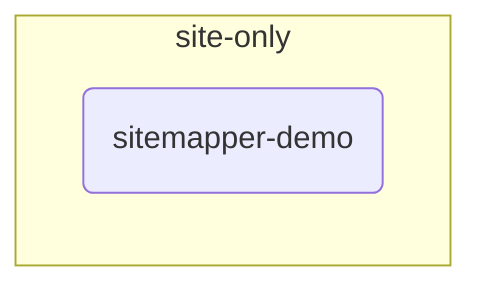

# Inventory

**Generated by `scripts/inventory.py` — do not edit.** Change the YAML and
re-run. `python scripts/inventory.py --check` fails if this file is stale.

1 sites · 0 projects · 1 workflows (1 agentic)

## Projects

| Project | Sites | Workflows | Purpose |
|---|---|---:|---|

## Workflows

| Owner | Workflow | Mode | Steps | Doc | Purpose |
|---|---|---|---:|:-:|---|
| `sitemapper-demo` | [`smart-issue`](../sites/sitemapper-demo/workflows/smart-issue.yaml) | agentic | 11 | ✓ | Ask what the issue is about, search for similar existing issues, present matches or create a new one |

## Sites

| Site | Base URL | Pages | Workflows | Scripts | Mapped | Verified |
|---|---|---:|---:|---:|---|---|
| `sitemapper-demo` | https://github.com/noskule-cc/SiteMappe… | 2 | 1 | 0 | 2026-05-03 | — |

