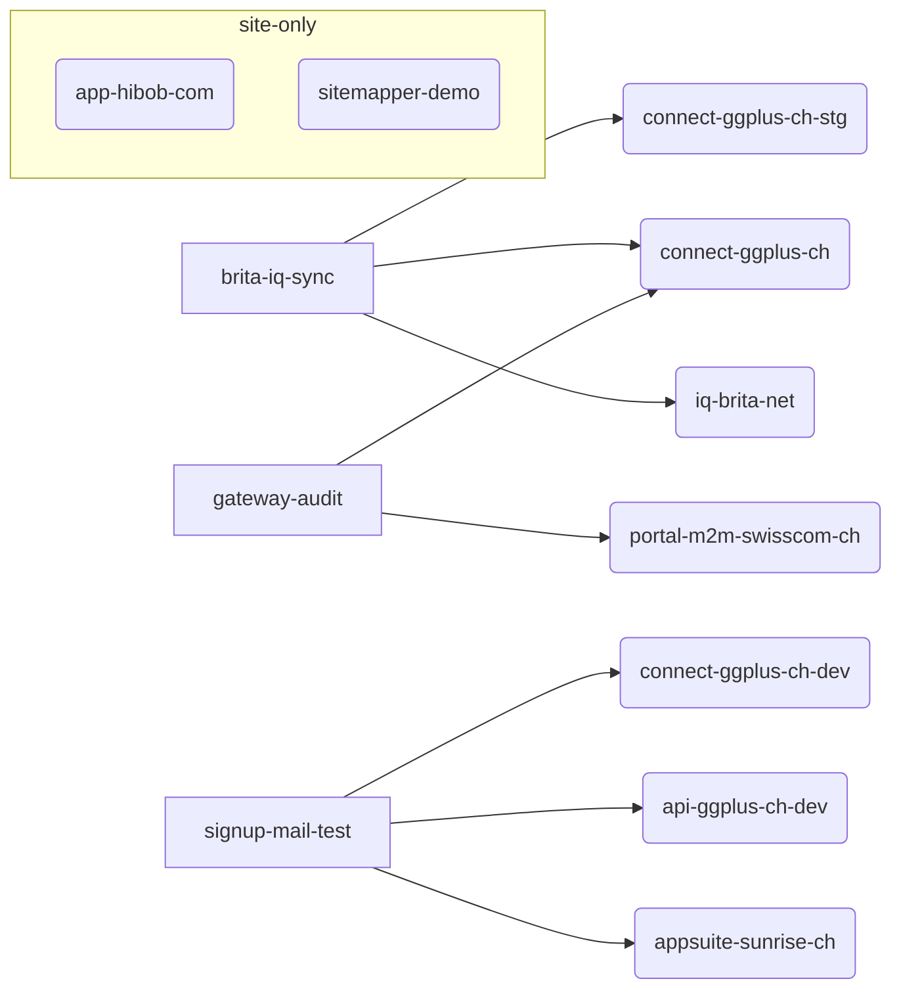

# Inventory

**Generated by `scripts/inventory.py` — do not edit.** Change the YAML and
re-run. `python scripts/inventory.py --check` fails if this file is stale.

10 sites · 3 projects · 14 workflows (9 agentic, 5 deterministic)

## Projects

| Project | Sites | Workflows | Purpose |
|---|---|---:|---|
| `brita-iq-sync` | `connect-ggplus-ch-stg`, `connect-ggplus-ch`, `iq-brita-net` | 2 | Verifies that the GG+connect <-> BRITA iQ integration actually syncs. GG+connect is the s… |
| `gateway-audit` | `connect-ggplus-ch`, `portal-m2m-swisscom-ch` | 3 | Cross-site audits of the IoT gateway fleet, correlating the GG+connect gateway-monitoring… |
| `signup-mail-test` | `connect-ggplus-ch-dev`, `api-ggplus-ch-dev`, `appsuite-sunrise-ch` | 1 | Registers a new user on a GG+ front end with a controlled e-mail address and proves the r… |

```mermaid
graph LR
  p_brita_iq_sync["brita-iq-sync"]
  s_connect_ggplus_ch_stg("connect-ggplus-ch-stg")
  p_brita_iq_sync --> s_connect_ggplus_ch_stg
  s_connect_ggplus_ch("connect-ggplus-ch")
  p_brita_iq_sync --> s_connect_ggplus_ch
  s_iq_brita_net("iq-brita-net")
  p_brita_iq_sync --> s_iq_brita_net
  p_gateway_audit["gateway-audit"]
  p_gateway_audit --> s_connect_ggplus_ch
  s_portal_m2m_swisscom_ch("portal-m2m-swisscom-ch")
  p_gateway_audit --> s_portal_m2m_swisscom_ch
  p_signup_mail_test["signup-mail-test"]
  s_connect_ggplus_ch_dev("connect-ggplus-ch-dev")
  p_signup_mail_test --> s_connect_ggplus_ch_dev
  s_api_ggplus_ch_dev("api-ggplus-ch-dev")
  p_signup_mail_test --> s_api_ggplus_ch_dev
  s_appsuite_sunrise_ch("appsuite-sunrise-ch")
  p_signup_mail_test --> s_appsuite_sunrise_ch
  subgraph site-only
    o_app_hibob_com("app-hibob-com")
    o_sitemapper_demo("sitemapper-demo")
  end
```

## Workflows

| Owner | Workflow | Mode | Steps | Doc | Last run | Purpose |
|---|---|---|---:|:-:|---|---|
| `brita-iq-sync` | [`kartusche-wechseln-test`](../projects/brita-iq-sync/workflows/kartusche-wechseln-test.yaml) | agentic | 51 | ✓ | 2026-07-30 | Biweekly regression suite for the Brita iQ filter integration on GG+connect. Runs against EITHER staging or p… |
| `brita-iq-sync` | [`test-brita-settings-propagation`](../projects/brita-iq-sync/workflows/test-brita-settings-propagation.yaml) | agentic | 15 | ✓ | — | Cross-site integration test: edit Karbonathärte on a Brita iQ Meter in GG+connect staging and confirm the new… |
| `gateway-audit` | [`gateway-flashlist`](../projects/gateway-audit/workflows/gateway-flashlist.yaml) | deterministic | 2 | ✓ | — | Turn a gateway-online-status run into a Flashlist grouped by Servicetechniker-Team — the handover artifact. g… |
| `gateway-audit` | [`gateway-online-status`](../projects/gateway-audit/workflows/gateway-online-status.yaml) | agentic | 7 | ✓ | 2026-07-28 | Triage the whole gateway fleet into one action per gateway by walking the gateway-status decision tree (see g… |
| `gateway-audit` | [`gateway-update-effect-tracking`](../projects/gateway-audit/workflows/gateway-update-effect-tracking.yaml) | agentic | 6 | ✓ | 2026-07-09 | Track the effect of the gateway firmware rollout (v1.15.1.2+) by measuring connectivity discrepancies. Produc… |
| `signup-mail-test` | [`check-signup-mail`](../projects/signup-mail-test/workflows/check-signup-mail.yaml) | agentic | 14 | ✓ | — | Find ONE signup/registration mail in the Sunrise mailbox and prove it is the right one: delivered to the addr… |
| `app-hibob-com` | [`extract-subtree`](../sites/app-hibob-com/workflows/extract-subtree.yaml) | agentic | 3 | ✓ | — | List every employee below a given person in the HiBob reporting hierarchy — their full org subtree (Regionall… |
| `connect-ggplus-ch` | [`switch-partner-to-maschinenpark`](../sites/connect-ggplus-ch/workflows/switch-partner-to-maschinenpark.yaml) | deterministic | 10 | ✓ | — | Switch to a partner account and navigate to their Maschinenpark (machine list) |
| `connect-ggplus-ch-dev` | [`test-maschinenpark-geraeteliste`](../sites/connect-ggplus-ch-dev/workflows/test-maschinenpark-geraeteliste.yaml) | deterministic | 46 | ✓ | 2026-06-26 | UI test for the machine-list (Geräteliste) page of a location. Covers structural presence (L1), every STANDAR… |
| `connect-ggplus-ch-dev` | [`test-maschinenpark-gruppierung-config`](../sites/connect-ggplus-ch-dev/workflows/test-maschinenpark-gruppierung-config.yaml) | deterministic | 10 | ✓ | — | UI test for custom Gerätegruppierungen - creating a Benutzer-Gruppierung scheme in Maschinenpark Einstellunge… |
| `connect-ggplus-ch-dev` | [`test-maschinenpark-spalten`](../sites/connect-ggplus-ch-dev/workflows/test-maschinenpark-spalten.yaml) | deterministic | 7 | ✓ | — | UI test for the Informations Spalten setting - toggling a column in Maschinenpark Einstellungen adds/removes … |
| `connect-ggplus-ch-stg` | [`test-brita-kartusche-wechseln`](../sites/connect-ggplus-ch-stg/workflows/test-brita-kartusche-wechseln.yaml) | agentic | 17 | ✓ | — | UI test for the Brita Filterkartusche wechseln wizard on a Brita iQ Meter - walks all four steps and confirms… |
| `iq-brita-net` | [`itest-daily-readout`](../sites/iq-brita-net/workflows/itest-daily-readout.yaml) | agentic | 8 | ✓ | — | Daily readout for the two iQ-Meter test devices (Werkstatt 3086769 and Pausenraum 10000) tracked on the BRITA… |
| `sitemapper-demo` | [`smart-issue`](../sites/sitemapper-demo/workflows/smart-issue.yaml) | agentic | 11 | ✓ | — | Ask what the issue is about, search for similar existing issues, present matches or create a new one |

## Sites

| Site | Base URL | Pages | Workflows | Scripts | Mapped | Verified |
|---|---|---:|---:|---:|---|---|
| `api-ggplus-ch-dev` | https://dev-api.ggplus.ch | 1 | 0 | 0 | 2026-08-05 | — |
| `app-hibob-com` | https://app.hibob.com | 2 | 1 | 1 | 2026-07-15 | — |
| `appsuite-sunrise-ch` | https://appsuite.sunrise.ch/appsuite/ | 2 | 0 | 0 | 2026-08-05 | — |
| `connect-ggplus-ch` | https://connect.ggplus.ch | 24 | 1 | 5 | 2026-04-30 | — |
| `connect-ggplus-ch-dev` | https://dev-connect.ggplus.ch | 7 | 3 | 0 | 2026-06-26 | — |
| `connect-ggplus-ch-stg` | https://stg-connect.ggplus.ch | 2 | 1 | 0 | 2026-07-29 | — |
| `iq-brita-net` | https://iq.brita.net | 2 | 1 | 3 | 2026-07-27 | — |
| `outlook-cloud-microsoft` | https://outlook.cloud.microsoft | 2 | 0 | 0 | 2026-07-30 | — |
| `portal-m2m-swisscom-ch` | https://portal.m2m.swisscom.ch | 2 | 0 | 0 | 2026-07-09 | — |
| `sitemapper-demo` | https://github.com/noskule-cc/SiteMappe… | 2 | 1 | 0 | 2026-05-03 | — |

