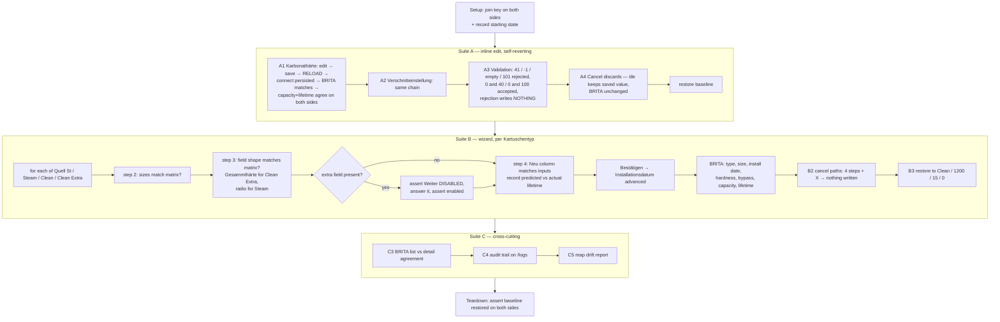

# kartusche-wechseln-test

Biweekly regression suite for the Brita iQ filter integration.
**GG+connect staging is the system of record; the BRITA iQ portal is the downstream
consumer.** Every write is verified on both sides.

- **Sites:** `connect-ggplus-ch-stg` → `iq-brita-net`
- **Mode:** agentic — cross-site value comparison, a per-type form shape, and
  first-run baselining all need judgement
- **Fixture device:** Werkstatt iQ Meter — connect `1eb28001-…`, BRITA `Id 353141283322738`
- **Cadence:** every 2 weeks
- **Report:** `projects/brita-iq-sync/results/kartusche-wechseln-test.<YYYY-MM-DD>.md`

## ⚠️ Blast radius

Suite A is fully self-reverting. **Suite B is not** — every `Bestätigen` writes an
irreversible cartridge installation record, and the full matrix is ~9 commits per
run. That trail is accepted on staging. Never point this at production.

## Scope

## The type matrix — regression baseline (established 2026-07-29)

Steps 2 **and** 3 of the wizard reshape per Kartuschentyp. If this table stops
matching, the wizard changed.

| Kartuschentyp | Filtergrösse | Hardness field | Verschnitteinstellung | Extra required field |
|---|---|---|---|---|
| Quell St | 450 / 600 / 1200 | `Karbonathärte*` | slider 0–100 % | **Hauswasserenthärtungsanlage\*** — *Enthärter installiert* / *Kein Enthärter installiert* |
| Steam | 450 / 600 / 1200 | `Karbonathärte*` | **radio 0 / 1 / 2 / 3** | **Dampfsystem\*** — *Direkteinsprizer* / *Boiler* |
| Clean | 1200 | `Karbonathärte*` | slider 0–100 % | — |
| Clean Extra | 1200 | **`Gesammthärte*`** | slider 0–100 % | — |

Quell St and Steam preselect **nothing** in the extra field and render `Weiter`
**disabled** until it is answered — so the "Weiter ×3 → Bestätigen" shortcut only
works for Clean and Clean Extra.

## Open questions — recorded on the first run, asserted afterwards

Only a commit can answer these, so run 1 writes them into the report and later runs
assert against them:

1. For **Clean Extra**, which BRITA field receives `Gesammthärte` — `Carbonate hardness`, or something else?
2. For **Steam**, how does the 0/1/2/3 Verschnitteinstellung render in BRITA's `Bypass percentage`?
3. Do `Dampfsystem` / `Hauswasserenthärtungsanlage` reach BRITA at all, or are they GG+connect-only?

## Known defects this suite watches

| Observed 2026-07-29 | Handling |
|---|---|
| Step-4 summary predicted *Verbleibende Lebensdauer* 51 → 52 Wochen; after commit the device still showed 51 | Report the delta; do **not** assert the prediction |
| BRITA `/purityciqs` list showed 52 weeks while its own detail page showed 51, same device, same moment | C3 reports the disagreement; detail page is authoritative |
| Karbonathärte is not isolated — 15 → 20 °dH moved lifetime 51 → 47 and capacity 8000 → 6000 L | Expected cascade; both sides must agree on the result |

## Automation traps

| Trap | Handling |
|---|---|
| All four step tabpanels are in the DOM at once — `text: "Abbrechen"` matches **four** buttons | Scope footer buttons to the **active** tabpanel |
| Step-4 body scrolls independently; a coordinate click on *Bestätigen* misses **silently** | Resolve by locator/ref only |
| The wizard renders outside `<main>` — `get_page_text` returns the page beneath it | Use `read_page` / `find` / screenshots |
| The URL never changes during the wizard | Assert on the stepper or the step's own fields |
| Inline-edit save takes ~10s and the page goes busy (script injection can time out) | Wait it out; never re-click Speichern |
| Two `Installationsdatum` values on the device page | Use the one in *Installierte Kartusche* (has `HH:MM:SS`) |
| Both Brita Filter pencils look identical | Scope to the containing tile |
| Optimistic UI could mask a failed write | A1/A2 **reload** before asserting |

## Related

- `projects/brita-iq-sync/workflows/test-brita-settings-propagation.yaml` — the narrow single-field propagation test
- `sites/connect-ggplus-ch-stg/workflows/test-brita-kartusche-wechseln.yaml` — the single-pass wizard smoke test
- `sites/connect-ggplus-ch-stg/pages/brita-kartusche-wechseln.yaml` — wizard map incl. the type matrix
- `sites/iq-brita-net/pages/flowmeter-detail.yaml` — the BRITA side
