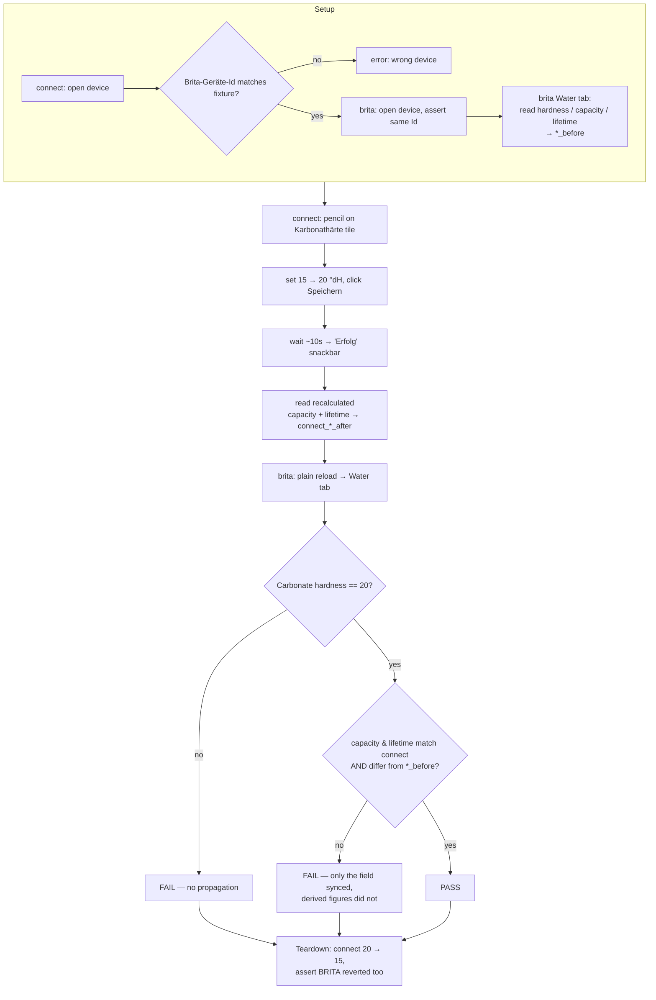

# test-brita-settings-propagation

Cross-site integration test. **GG+connect is the system of record** for a Brita iQ
device's filter configuration; the BRITA iQ portal is the downstream consumer. This
workflow writes on one side and reads back on the other.

- **Sites:** `connect-ggplus-ch-stg` (https://stg-connect.ggplus.ch) → `iq-brita-net` (https://iq.brita.net)
- **Join key:** GG+connect *Brita-Geräte-Id* == BRITA *Id:* under the device title — `353141283322738`
- **Mode:** agentic — the pass condition is a cross-site value comparison across
  different renderings and units, which needs judgement.
- **Self-reverting:** teardown restores the baseline on both sides.

## Fixture device (same physical meter, two systems)

| | |
|---|---|
| GG+connect | `/geraete/geraet/1eb28001-d55d-1032-8a18-0c14e0ab0000` — *iQ Meter Anzeige + Sensor 100-700 G3/4"*, partner *Gehrig Group AG test* |
| BRITA | `/flowmeters/dae9a265-…/d3e78486-…` — *3086769 - iQ Meter … - G5UYU6ZPRE - Werkstatt*, org *Gehrig Group* |

## Flow

## Verified behaviour (2026-07-29)

Propagation is **real and near-immediate** — no manual sync step, a plain reload of
the BRITA page is enough:

| Field | GG+connect | BRITA | Before | After |
|---|---|---|---|---|
| Carbonate hardness | Karbonathärte | Water tab → *Carbonate hardness* | 15.0 / 15 °dH | **20.0 / 20 °dH** |
| Lifetime | Verbleibende Lebensdauer | *Lifetime remaining* | 51 Wochen / 51 weeks | **47 Wochen / 47 weeks** |
| Capacity | Verbleibende Kapazität | *Capacity remaining* | 8000 Liter / 8000 litres | **6000 Liter / 6000 litres** |
| Bypass | Verschnitteinstellung | *Bypass percentage* | 0 % | 0 % (untouched) |

Reverting 20 → 15 restored all three on both sides.

**Karbonathärte is not an isolated field** — saving it recalculates cartridge
capacity and lifetime. Harder water ⇒ less capacity. A test that edits it must expect
the two derived tiles to move as well.

## Comparison traps

| Trap | Handling |
|---|---|
| GG+connect renders one decimal (`20.0`), BRITA an integer (`20 °dH`) | Compare numerically, never as strings. |
| Units differ: `Liter`/`litres`, `Wochen`/`weeks` | Strip the unit word before comparing. |
| BRITA's `/purityciqs` **list** disagreed with its own detail page (52 vs 51 weeks, same moment) | Read the **detail** page for propagation checks. |
| BRITA `Cartridge Installation Date` is date-only; GG+connect has `HH:MM:SS` | Cannot distinguish two same-day replacements. |
| The GG+connect save is slow (~10s) and the page goes busy — script injection can time out | Wait it out; do not re-click Speichern. |
| Both pencil icons in the Brita Filter card look identical | Scope the locator to the Karbonathärte tile. |

## Related

- `sites/connect-ggplus-ch-stg/pages/geraet-detail.yaml` — the Brita Filter card and inline editors
- `sites/iq-brita-net/pages/flowmeter-detail.yaml` — the BRITA side
- `sites/connect-ggplus-ch-stg/workflows/test-brita-kartusche-wechseln.yaml` — the cartridge-replacement wizard on the same device
