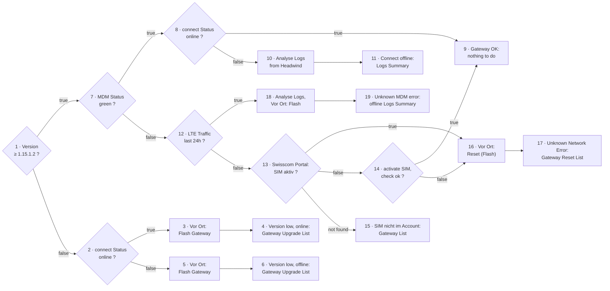

# gateway-online-status

Triage the whole gateway fleet into **one action per gateway** by walking the
gateway-status decision tree — so the fleet is worked off by action instead of read
row by row.

**At a glance**

- **Sites:** connect-ggplus-ch (API, no browser) → portal-m2m-swisscom-ch (browser)
- **Mode:** agentic
- **Join key:** monitoring `Seriennummer` = Swisscom `Gateway Ausprägung`
- **Inputs (fixtures):** `version_threshold` 1.15.1.2 · excluded contracts 1000 / 10000 / 3086769 · `swisscom_account_id` 02001639
- **Outputs:** one Rapport per gateway (the seven terminal boxes below) + per-gateway `triage`, `lte_results`, `headwind_logs`
- **Diagram:** [`gateway_online_status.drawio`](./gateway_online_status.drawio) — swimlanes: `connect Version · MDM Status · connect Status · LTE Status · Proposed Action · Rapport`. Every box is numbered (1–19); those numbers are the reference key used here and in the result doc.

The whole `connect Version → MDM → connect Status → Logs` chain runs **against the
BFF API with no browser** — see [`scripts/`](../../../sites/connect-ggplus-ch/scripts/).
Only the Swisscom side (LTE traffic + SIM status) drives Chrome (its portal is a Vaadin
app with no usable API).

## Flow

The **Proposed Action** lane is *what we still have to do*; the **Rapport** lane is the
written representation of that — one of seven report sections.

## Rapport outcomes (= the result-doc sections)

Every gateway kept after exclusions ends in exactly one of these **seven** Rapport boxes,
and each is a section of the dated run's result doc.

| § | Rapport (report section) | Reached when | Site visit? |
|---:|---|---|:---:|
| **4** | Version low, online: Gateway Upgrade List | Version low **and** connect online → 3 Flash | ✓ |
| **6** | Version low, offline: Gateway Upgrade List | Version low **and** connect offline → 5 Flash | ✓ |
| **9** | Gateway OK: nothing to do | MDM green + connect online (8 = true) — **or** SIM reactivated (14 = true) | — |
| **11** | Connect offline: Logs Summary | MDM green but connect offline → 10 Analyse Logs | desk (logs) |
| **15** | SIM nicht im Account: Gateway List | serial **not found** in the Swisscom account (13 = not found) | — *(inventory)* |
| **17** | Unknown Network Error: Gateway Reset List | no LTE traffic; SIM active, or reactivation failed → 16 Reset (Flash) | ✓ |
| **19** | Unknown MDM error: offline Logs Summary | LTE traffic present but connect offline → 18 Analyse Logs + Flash | ✓ |

## Version low → split by connect Status (nodes 2–6)

A gateway below the version threshold (or reporting no version) is **not one bucket** any
more. Before deciding the action, ask node 2 — **is it online in connect?**

- **online (2 = true)** → the device is *reachable*. It still needs the newer connect app,
  but because we can talk to it, it is a candidate for a remote/OTA push rather than a
  guaranteed truck roll. Tracked as **§4 — Version low, online**.
- **offline (2 = false)** → unreachable, so the flash has to happen on site. Tracked
  separately as **§6 — Version low, offline**.

Both currently route to *Vor Ort: Flash Gateway*; the split is what lets you work the
reachable ones first (or remotely) and reserve site visits for the offline list.

Each is still reported **split by reason** — `VERSION_BELOW_THRESHOLD` vs
`NO_VERSION_REPORTED` — because *"we can't ask the device what it runs"* is a different
claim from *"it runs an old version"* (a reporting problem vs an update problem).

## Why the two lower branches differ (nodes 7–19)

Below the MDM node the tree is asymmetric on purpose:

- **MDM red** → the management channel is *dead*; no remote lever is left. Ask the
  **network** whether the device is even alive (the LTE / Swisscom branch, nodes 12–19).
- **MDM green** → the device *is* reachable, so a Swisscom lookup would only confirm what
  MDM already proved. Ask the **device** instead (Headwind logs, node 10).

### The MDM-red branch (nodes 12–19)

1. **12 · LTE Traffic last 24h?**
   - **true** → alive and moving data but unreachable in connect (handshake/DNS). → **18**
     Analyse Logs + *Vor Ort: Flash* → Rapport **19**.
   - **false** → no data; ask *why* before sending anyone. → **13**.
2. **13 · Swisscom Portal: SIM aktiv?**
   - **true** → SIM live but silent → **16** *Vor Ort: Reset (Flash)* → Rapport **17**.
   - **false** → **14** *activate SIM, check ok?* — a **remote-recovery step**: reactivate
     and re-check. **ok → 9 Gateway OK (no technician);** not ok → **16** → **17**.
     *This step mutates Swisscom state — it is operator-gated (see the definition).*
   - **not found** → the serial isn't in the Swisscom account → Rapport **15**
     *SIM nicht im Account*: a SIM-**inventory** problem, **not** a gateway fault and **not**
     a site visit.

> **Operational cost:** boxes **4, 6, 17, 19** each mean a technician trip (3/5/16/18 are
> the site-visit actions behind them). Boxes **9**, **11** (desk) and **15** do **not**.
> State the site-visit total plainly — it is what the run actually asks the business to do.
>
> **Not modelled in the tree:** WiFi gateways have no SIM, so "LTE traffic?" is undefined
> for them (not false) — handled outside this branch (`lte_skipped_wifi`), not via node 12.

## Analyse Logs from Headwind (nodes 10 and 18)

`POST /gateway/api/v1/hmdm/logs` at **severity WARNING over the last 5 days**. The severity
filter is cumulative, so WARNING **already includes ERROR**, and the noise
(`Push long polling inquiry` = VERBOSE, `Configuration updated` = INFO) is dropped
*server-side*.

[`get_gateway_logs.py`](../../../sites/connect-ggplus-ch/scripts/get_gateway_logs.py)
classifies *why* a gateway is unreachable:

| Signature | Meaning |
|---|---|
| `NO_DNS` | Cannot resolve `bff.ggplus.ch` — no network at all |
| `HUB_HANDSHAKE` | Network is up, but the SignalR handshake with connect fails |
| `WATCHDOG_REBOOT` | Watchdog reboot loop — a service stopped reporting its heartbeat |
| `CONFIG_FAILED` | Config update failing (network error) |

`HUB_HANDSHAKE` **plus** real LTE traffic (node 18) is the signature of a false-negative
"offline": the gateway is alive and moving data, it just can't complete its handshake with
connect. On the MDM-red side the log read is **best-effort** — a device that is truly off
Headwind may have logged nothing recent, which is why box 19 is named *Unknown MDM error*.

## Data sources (verified 2026-07-13)

| Lane | Source |
|---|---|
| connect Version | `GET /gateway/api/v1/gateway/all` — but the Version column is a **hybrid**: `hmdmConnectVersionInstalled`, falling back to `firmwareVersion` when MDM is grey |
| MDM Status | same call, `hmdmState` (`Green` / `Red` / `Grey`) |
| connect Status | **SignalR hub** `/gateway/device-connection` → invoke `AddDeviceWatcher` → `ConnectionState`. The REST list's `connectionState` is a placeholder (`"Unconfigured"` for all 376) and must not be used |
| LTE Traffic · SIM status | Swisscom M2M portal (browser — Vaadin, no API) |

The page's **CSV Export button is not an API call** — it builds a Blob in the browser
from data already in memory. There is no CSV endpoint; the script reproduces the same
columns from the API instead.

## See also

- Definition (source of truth): [`gateway-online-status.yaml`](./gateway-online-status.yaml)
- Sibling workflow: [`gateway-update-effect-tracking.md`](./gateway-update-effect-tracking.md) — *"what did the rollout change?"* (three discrepancy metrics). This workflow answers *"what do we DO with each gateway?"*. They share the DOM scrape and the Swisscom recipe deliberately.
