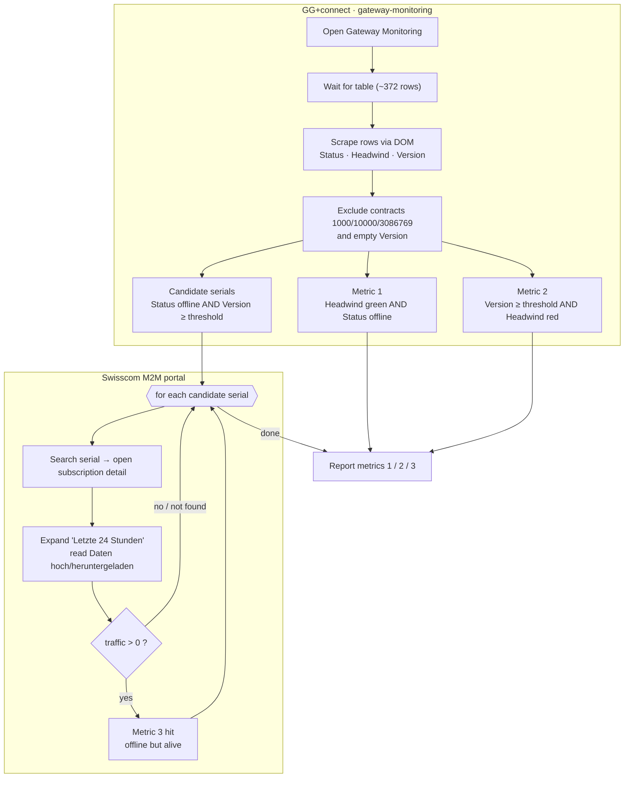

# gateway-update-effect-tracking

Track the effect of the gateway firmware rollout (v1.15.1.2+) by measuring three
connectivity discrepancies across **GG+connect gateway-monitoring** and the
**Swisscom M2M portal**.

**At a glance**

- **Sites:** connect-ggplus-ch → portal-m2m-swisscom-ch (cross-site)
- **Mode:** agentic
- **Join key:** monitoring `Seriennummer` = Swisscom `Gateway Ausprägung`
- **Inputs (fixtures):** `version_threshold` 1.15.1.2 · excluded contracts 1000 / 10000 / 3086769 · `swisscom_account_id` 02001639
- **Outputs:** `metric1_count`, `metric2_count`, `metric3_count` (+ per-serial `metric3_results`)

## Flow

## Metrics

| # | Meaning | Source |
|---|---------|--------|
| 1 | Headwind online (green) **but** gateway Status offline | monitoring DOM scrape |
| 2 | Version ≥ 1.15.1.2 **but** Headwind offline (red) | monitoring DOM scrape |
| 3 | Status offline + version ≥ 1.15.1.2 **but** has Swisscom last-24h traffic (a false-negative "offline") | per-serial Swisscom UI check |

## See also

- Definition (source of truth): [`gateway-update-effect-tracking.yaml`](./gateway-update-effect-tracking.yaml)
- Latest run: [`../results/gateway-update-effect-tracking.2026-07-09.md`](../results/gateway-update-effect-tracking.2026-07-09.md)
