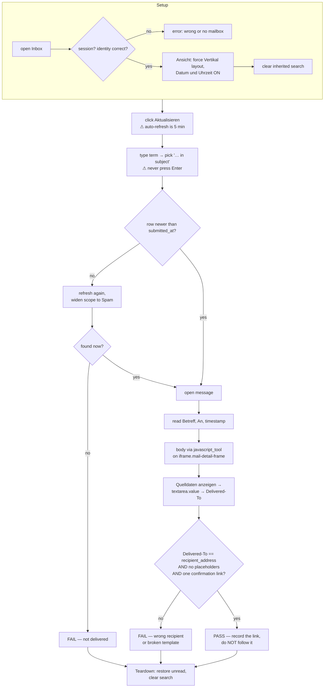

# check-signup-mail

The **verification half** of the signup test. A person (or a browser run) submits a
registration on one of the three GG+ front ends; this workflow proves the resulting mail
actually arrived and is correct.

- **Site:** `appsuite-sunrise-ch` (https://appsuite.sunrise.ch/appsuite/) — the mailbox of
  `benjamin.behringer@sunrise.ch`
- **Mode:** agentic — "is this the mail we just triggered" and "are all placeholders
  substituted" need judgement.
- **Read-only:** the only mutation is the unread flag, restored in teardown.

## Parameters

| | |
|---|---|
| `recipient_address` | the address entered in the registration form |
| `search_term` | invariant fragment of the expected Betreff (default `Registrierung`) |
| `submitted_at` | `HH:MM` of the submit — anything older is a previous run's mail |

## Flow

## Why the two odd extraction steps

| What | Why the obvious way fails |
|---|---|
| Body via `javascript_tool` on `iframe.mail-detail-frame` | The body renders in an iframe. `get_page_text` returns only the header block and `find` reports body text as absent while it is on screen. The iframe is same-origin, so `contentDocument.body.innerText` and `querySelectorAll('a')` work directly. |
| `Delivered-To` via the Quelldaten modal | The visible "An" line is only the header the sender wrote. For plus-aliases, catch-alls and forwards it does **not** prove where the mail was delivered. The modal's textarea holds the full raw MIME — but its value is not in the accessibility tree, so it too needs `javascript_tool`. |

## Traps this workflow is built around

| Trap | Handling |
|---|---|
| Auto-refresh interval is **5 minutes** | Always click Aktualisieren and poll; never call a mail missing on the first look. |
| Enter in the search box **reloads the app** and drops the query | Type, then click a suggestion (`… in subject`). |
| Search scope defaults to the **current folder** | Widen via `Weitere…` to cover Spam before reporting non-delivery. |
| Layout / sort / threading are **sticky per user** | Setup forces Vertikal; in Liste or Kompakt the detail column does not exist. |
| Opening an unread mail **mutates a private mailbox** | Teardown marks it unread again. |
| Following the confirmation link **activates the account** | Out of scope here — record the URL, decide separately. |

## Related

- `sites/appsuite-sunrise-ch/pages/mail-list.yaml` — locating surface
- `sites/appsuite-sunrise-ch/pages/mail-message.yaml` — assertion surface, incl. both
  `javascript_tool` recipes
- `../project.yaml` — the three registration paths this verifies
