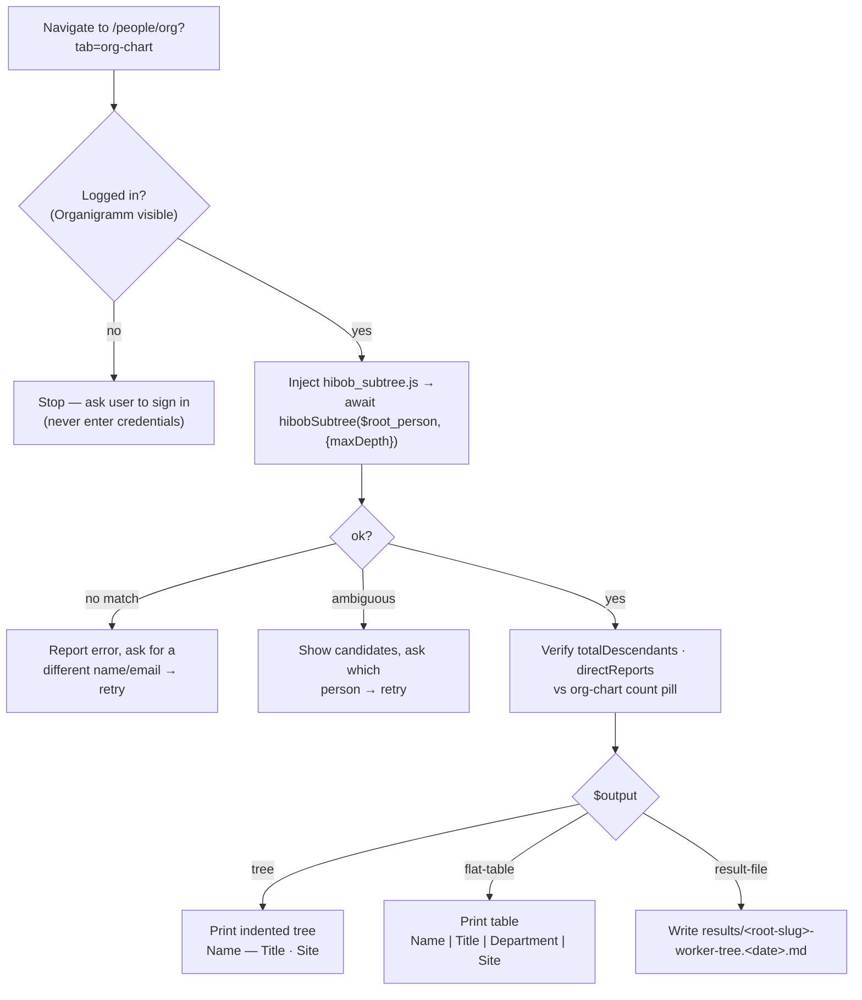

# extract-subtree

List every employee below a defined person in the HiBob reporting hierarchy — their
full org subtree, resolved to name / title / department / location.

**At a glance** — Site: app-hibob-com · Mode: agentic · In: `$root_person` (name or
email), `$max_depth?`, `$output?` → Out: `subtree` (`{root, totalDescendants,
directReports, tree, flat}`)

## How it works

The reporting edges live only in the Organigramm, but the underlying data is a clean
JSON API. `hibob_subtree.js` runs **in the logged-in browser tab** (HiBob's `/api` is
cookie-authed — no token, no headless mode), reads all 143 employees from
`/api/employees/essentials`, walks `work.reportsTo` edges down from the chosen root,
and resolves title/department ids via `/api/company/metadata/lists/`. The node count is
cross-checked against the org chart's own "total · direct" pill.

## Flow

## See also

- Script: [`../scripts/hibob_subtree.js`](../scripts/hibob_subtree.js)
- Page map: [`../pages/mitarbeitende-organigramm.yaml`](../pages/mitarbeitende-organigramm.yaml)
- Example output: `results/<root-slug>-worker-tree.<date>.md` — run outputs are **not
  committed** (they are lists of named employees); they stay local. See `.gitignore`.
