# test-maschinenpark-geraeteliste

UI test for the machine-list (Geräteliste) page of a location — structural presence (L1),
every STANDARD Gerätegruppierungen option (C), navigation into the device preview (L2),
filter re-binding (L4) and device + location filter behaviour (L5).

**At a glance** — Site: `connect-ggplus-ch-dev` · Mode: `deterministic` ·
In: fixtures `$partner_id`, `$location_id`, `$location_name`, `$device_filter_term`,
`$matching_device`, `$non_matching_device`, `$location_filter_term`, `$location_match`,
`$location_nonmatch` → Out: assertions only (no `capture`) · **Mutating** — stars one
device in `setup`, un-stars it in `teardown`.

## Flow

```mermaid
flowchart TD
  subgraph SETUP["setup — make the run hermetic"]
    S1["navigate /geraete/maschinenpark/$partner_id/$location_id"] --> S2["wait: sections load asynchronously"]
    S2 --> S3["input grouping = 'IOT-Geräte'<br/>resets the STICKY grouping so Favoriten / Neu / Bestehender exist"]
    S3 --> S4["wait: list re-groups"]
    S4 --> S5["click device-favorite-toggle on $matching_device<br/>guarantees a Favoriten section exists"]
    S5 --> S6["wait: device moves into Favoriten"]
  end

  S6 --> A1

  subgraph STEPS["steps"]
    A1["L1 · 6 asserts — location-header contains $location_name,<br/>device-filter visible, grouping value = 'IOT-Geräte',<br/>Favoriten / Neu / Bestehender sections visible"] --> B1
    B1["C · sweep the STANDARD groupings, one input + wait + assert each:<br/>'Keine' → 'Status' → 'Hersteller' → 'Modell' → 'Fahrzeugnummer' → 'Fahrzeugtyp'<br/>each asserts the dropdown value actually applied"]
    B1 --> B2["C7 · Favoriten still visible under 'Keine' and under 'Status'"]
    B1 --> B3["C · Bestehender ABSENT under 'Hersteller'<br/>the IOT-only section proves regrouping is real"]
    B2 --> B4
    B3 --> B4
    B4["C · restore grouping = 'IOT-Geräte'<br/>assert Bestehender returns — regrouping is reversible"]
    B4 --> C1["L5 · input device-filter = $device_filter_term → wait"]
    C1 --> C2["assert device-row $matching_device visible<br/>assert device-row $non_matching_device absent"]
    C2 --> C3["L4 · assert no-match-message — a section emptied by the filter<br/>shows the notice, so counts re-bound to 0"]
    C3 --> C4["click device-filter-clear (X) → wait<br/>assert $non_matching_device is restored"]
    C4 --> D1["L5 · input location-filter = $location_filter_term → wait"]
    D1 --> D2["assert sidebar keeps $location_match<br/>assert sidebar drops $location_nonmatch"]
    D2 --> E1["L2 · click device-row $matching_device → wait for the drawer"]
    E1 --> E2["assert geraet-vorschau open-full-view-button visible"]
    E2 --> E3["assert url_matches '/geraete/maschinenpark/.*/geraet/.*'<br/>the drawer is deep-linkable"]
  end

  E3 --> T1

  subgraph TEARDOWN["teardown — restore original state"]
    T1["navigate back to the list<br/>the last step left the preview drawer open"] --> T2["wait"]
    T2 --> T3["click device-favorite-toggle on $matching_device — un-star"]
  end
```

## Notes

- **Why `setup` stars a device.** Favorites are mutable shared data and the Favoriten
  section is not rendered at all when nothing is starred; the grouping selection is
  sticky per user. Both are reset before any assertion runs.
- **Partner-Gruppierungen are deliberately out of scope** — they are user-created data,
  not a stable contract. Custom schemes are covered by
  [`test-maschinenpark-gruppierung-config.yaml`](test-maschinenpark-gruppierung-config.yaml),
  which creates and deletes its own.
- Element semantics and page-level hazards: see the page maps linked below rather than
  this file.

## See also

- [`test-maschinenpark-geraeteliste.yaml`](test-maschinenpark-geraeteliste.yaml) — source of truth
- Page maps: [`maschinenpark-geraeteliste.yaml`](../pages/maschinenpark-geraeteliste.yaml),
  [`geraet-vorschau.yaml`](../pages/geraet-vorschau.yaml)
- Latest result: [`test-maschinenpark-geraeteliste.2026-06-26.md`](../results/test-maschinenpark-geraeteliste.2026-06-26.md)
  — 14/14 passed, but that run predates the `setup`/`teardown` and grouping-sweep steps
  above, so it does not cover the current workflow.
