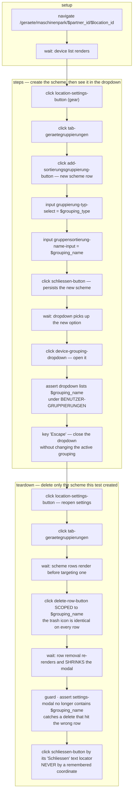

# test-maschinenpark-gruppierung-config

UI test for custom Gerätegruppierungen — creating a Benutzer-Gruppierung scheme in
Maschinenpark Einstellungen makes it appear as an option in the Gerätegruppierungen
dropdown.

**At a glance** — Site: `connect-ggplus-ch-dev` · Mode: `deterministic` ·
In: fixtures `$partner_id`, `$location_id`, `$grouping_type` (`"Benutzer-Gruppierung"`,
user-scoped = smallest blast radius), `$grouping_name` (`"SiteMapper Test Gruppe"`)
→ Out: assertions only (no `capture`) · **Mutating** — creates a grouping scheme and
deletes it in `teardown`.

## Flow

## Why teardown is the risky half

The teardown carries its own assertion — the only assert outside `steps` — because the
delete is the dangerous operation, not the create. The trash icon is identical on every
scheme row and deleting a row shifts the remaining controls upward, so an unscoped or
coordinate-based click can silently remove a pre-existing, shared Partner-Gruppierung.
Scoping the delete by `$grouping_name`, asserting the row is gone, and re-locating
Schliessen by text are all load-bearing. See the page map for the full hazard note.

## See also

- [`test-maschinenpark-gruppierung-config.yaml`](test-maschinenpark-gruppierung-config.yaml) — source of truth
- Page maps: [`maschinenpark-geraeteliste.yaml`](../pages/maschinenpark-geraeteliste.yaml),
  [`maschinenpark-einstellungen.yaml`](../pages/maschinenpark-einstellungen.yaml)
- Companion test for the STANDARD groupings:
  [`test-maschinenpark-geraeteliste.md`](test-maschinenpark-geraeteliste.md)
- No result file recorded yet under [`../results/`](../results/).
