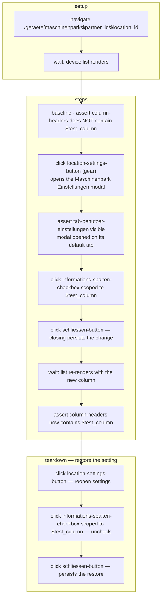

# test-maschinenpark-spalten

UI test for the Informations Spalten setting — toggling a column in Maschinenpark
Einstellungen adds or removes that column in the device list.

**At a glance** — Site: `connect-ggplus-ch-dev` · Mode: `deterministic` ·
In: fixtures `$partner_id`, `$location_id`, `$test_column` (`"Hersteller"`, a column
that is off by default) → Out: assertions only (no `capture`) · **Mutating** — the
column toggle is a persisted user setting; `teardown` unchecks it again.

## Flow

## What it proves

The Informations-Spalten checkboxes map 1:1 onto device-list columns: checking
`$test_column` adds that column header, unchecking removes it. The baseline assert at
the start is what makes the second assert meaningful — it establishes that the column
was not already present.

Element semantics and modal hazards (the modal intercepts clicks to the list, the
Schliessen button must be resolved by locator) live in the page maps linked below.

## See also

- [`test-maschinenpark-spalten.yaml`](test-maschinenpark-spalten.yaml) — source of truth
- Page maps: [`maschinenpark-geraeteliste.yaml`](../pages/maschinenpark-geraeteliste.yaml),
  [`maschinenpark-einstellungen.yaml`](../pages/maschinenpark-einstellungen.yaml)
- No result file recorded yet under [`../results/`](../results/).
