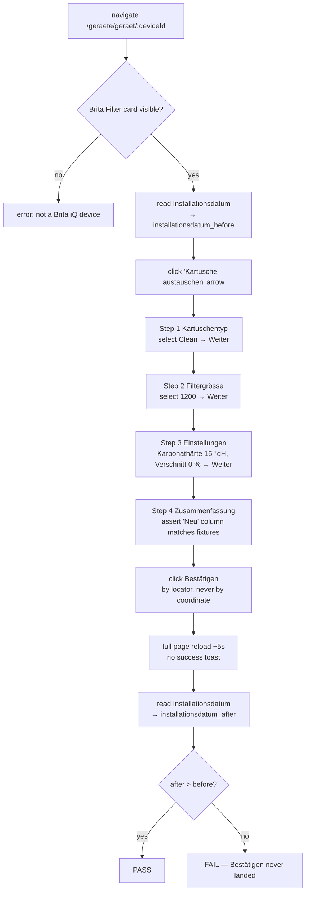

# test-brita-kartusche-wechseln

UI test for the **Brita Filterkartusche wechseln** wizard on a Brita iQ Meter in
GG+connect staging.

- **Site:** `connect-ggplus-ch-stg` (https://stg-connect.ggplus.ch)
- **Mode:** agentic — the outcome is a before/after timestamp comparison, and
  `schema/workflow.yaml`'s `expect` vocabulary has no *not-equals*. Every other
  step is mechanical.
- **Fixture device:** `1eb28001-d55d-1032-8a18-0c14e0ab0000` —
  *iQ Meter Anzeige + Sensor 100-700 G3/4"*, partner *Gehrig Group AG test*

## ⚠️ Mutating and irreversible

There is no "un-replace a cartridge" action, so this workflow **has no teardown**.
Every run writes a new cartridge installation record on the fixture device.
Staging only — never point it at production.

## What it proves

The only field that reliably changes on commit is **Installationsdatum** inside the
*Installierte Kartusche* tile. Verbleibende Lebensdauer, Verbleibende Kapazität and
Volumen total stay put — even though the step-4 summary predicts a lifetime increase
(observed 2026-07-29: summary said 51 → 52 Wochen, device still showed 51). Assert on
the timestamp, not on the capacity figures.

## Flow

## Traps this test is written around

| Trap | Mitigation |
|---|---|
| Step-4 body scrolls independently; the footer starts below the fold. A coordinate click on *Bestätigen* misses **silently** — the modal just stays open. | Always resolve *Bestätigen* by locator/ref. |
| The wizard renders **outside `<main>`**, so `get_page_text` returns the underlying device page, not the modal. | Use `read_page` / `find` / screenshots inside the wizard. |
| The URL never changes while the wizard runs. | Assert on the step indicator or a step's own fields, not on `url_matches`. |
| No success toast; a blank white page with a red progress bar appears for ~5s. | Explicit `wait` before the post-condition read. |
| Steps 1 and 2 arrive **preselected** with the device's current values. | "Weiter ×3 → Bestätigen" still commits — a no-change run is not a no-op. |
| The device page carries **two** `Installationsdatum` values. | Read the one inside the *Installierte Kartusche* tile (date **+ time**), not the device install date under *Technische Daten*. |

## Related

- Page maps: `pages/geraet-detail.yaml`, `pages/brita-kartusche-wechseln.yaml`
- Cross-site: the same device appears in the BRITA iQ portal
  (`sites/iq-brita-net`), joined on **Brita-Geräte-Id** `353141283322738`.
