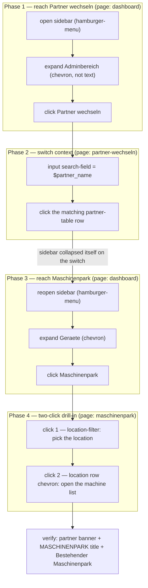

# switch-partner-to-maschinenpark

Switch to a partner account and navigate to their Maschinenpark (machine list).

**At a glance** — Site: `connect-ggplus-ch` · Mode: deterministic · In: `$partner_name` → Out: _(no captures)_

Read-only navigation: it changes the session's partner context but writes no
records. Not a test — there is no `assert` step and no result file.

## Flow

## Why the shape is what it is

- **The sidebar is opened twice.** Phase 3 repeats the hamburger step because
  switching partner collapses the sidebar — see the gotchas in
  [`../pages/partner-wechseln.yaml`](../pages/partner-wechseln.yaml), which also
  cover the chevron-vs-text click targets used in phases 1 and 3.
- **The last two clicks are one navigation, not two.** Maschinenpark shows
  locations first and the machine list only after a second click; documented in
  [`../pages/maschinenpark.yaml`](../pages/maschinenpark.yaml). Dropping either
  click leaves you on the wrong level with no error.

## See also

- [`switch-partner-to-maschinenpark.yaml`](switch-partner-to-maschinenpark.yaml)
