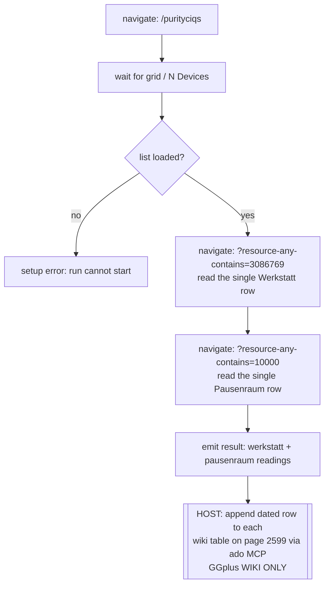

# iQ-Meter Test — Daily Readout

Reads the two iQ-Meter **test** devices from the BRITA iQ filter list and emits their
current **Capacity remaining** + **Last activity**. The host then appends one dated row
per device to the GG+ wiki test page (2599). SiteMapper only reads; the wiki write is the
host's job and is confined to **GGplus WIKI ONLY** (see `CLAUDE.md` guardrail).

| Device | List name fragment | Wiki table |
|---|---|---|
| Werkstatt | `3086769` (…G5UYU6ZPRE - Werkstatt) | `Werkstatt Test` |
| Pausenraum | `10000` (…353141283975881 - Pausenraum) | `Pausenraum Test` |

**Row written per device:** `| Datum (YYYY-MM-DD) | Letzte Aktualisierung | Kapazität übrig | Bemerkung |`, newest on top. A `-` reading → empty cell (offline), never `0`.

**Why one device per page load:** the grid is virtualized — only ~16 of the 18 rows are
in the DOM at any moment, so scanning the whole list can silently skip a target device.
The `?resource-any-contains=` filter leaves exactly one row and removes the guesswork.

**Not modelled here:** the wiki append (`G`) is deliberately outside the workflow —
SiteMapper is sink-agnostic. See `itest-daily-readout.yaml` for extraction details and the
exact wiki path/id.
