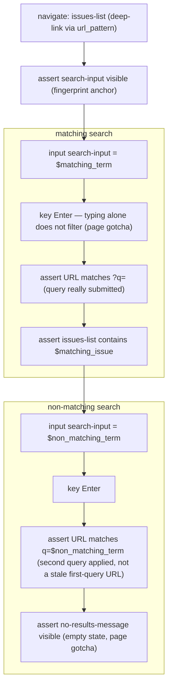

# search-issues

Search the issues list and assert the filtered result state — a matching term
shows the issue, a non-matching term shows the empty state.

**At a glance** — Site: `sitemapper-demo` · Mode: deterministic · Trust:
verified (2026-08-19) · Effect: read-only · In: fixtures `$matching_term`,
`$matching_issue`, `$non_matching_term` (no parameters) → Out: none
(assert-only)

This is the acceptance flow for the headless runner (issue #26): every step is
navigate/input/key/assert, so `scripts/run.py` can execute it with no LLM. It
is pinned to the demo repo's standing issue #1, which keeps both branches of
the run deterministic.

## Flow

Both searches press Enter deliberately: on this page typing does not filter,
and each search is followed by its own URL assertion — `?q=` after the first,
`q=$non_matching_term` after the second — proving each query was genuinely
applied rather than judged against a stale or unfiltered page. Locators and
the Enter-to-apply / empty-state behaviour live in the page map — see below.

## See also

- [`search-issues.yaml`](search-issues.yaml)
- Page map: [`../pages/issues-list.yaml`](../pages/issues-list.yaml)
- Latest result: [`../results/search-issues.2026-08-19.md`](../results/search-issues.2026-08-19.md)
  — the reviewed green headless run behind `trust: verified`.
