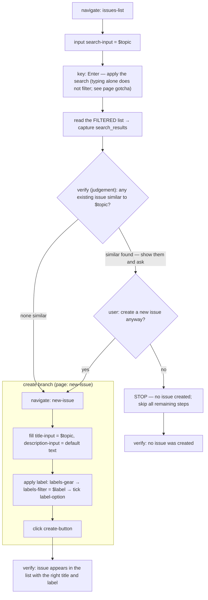

# smart-issue

Ask what the issue is about, search for similar existing issues, present matches
or create a new one.

**At a glance** — Site: `sitemapper-demo` · Mode: agentic · Trust: draft ·
Effect: mutating · In: `$topic`, `$label` (optional, default `bug`) → Out:
`search_results`

Mutating: the create branch opens a real issue. Deciding whether to open it is
the point of the workflow, which is also why `trust` stays `draft` — an agentic
workflow is never `verified` for blind runs.

## Flow

## The decision node

The `action: verify` step after the read is the only reason this workflow is
`agentic`: it judges similarity from `search_results` and hands the choice to
the user. Every other step is mechanical. The step's own text now spells out
the early exit — if the user declines, stop there and execute none of the
remaining steps — and the trailing `verify:` block checks both outcomes
(created-with-correct-title-and-label vs. nothing-created). Structurally,
though, the steps after it are still an unconditional list: the schema has no
conditional steps yet, so the exit lives in prose, and only an LLM executor
honours it.

Label handling inside the create branch is unconditional: `$label` has a
default, so the three label steps always execute once the branch is entered.

## See also

- [`smart-issue.yaml`](smart-issue.yaml)
- Page maps: [`../pages/issues-list.yaml`](../pages/issues-list.yaml),
  [`../pages/new-issue.yaml`](../pages/new-issue.yaml)
