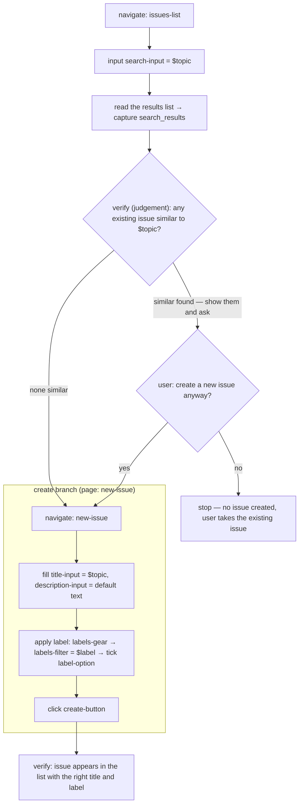

# smart-issue

Ask what the issue is about, search for similar existing issues, present matches
or create a new one.

**At a glance** — Site: `sitemapper-demo` · Mode: agentic · In: `$topic`, `$label` (optional, default `bug`) → Out: `search_results`

Mutating: the create branch opens a real GitHub issue. The decision about
whether to open it is the point of the workflow.

## Flow

## The decision node

Step 4 (`action: verify`) is the only reason this workflow is `agentic`: it
judges similarity from `search_results` and hands the choice to the user. Every
other step is mechanical. Note that the **`no` branch is not encoded in the
YAML** — the steps after step 4 are an unconditional list, so the runner, not
the file, is what stops the run. See the flag in the notes below.

Label handling is unconditional: `$label` has a default, so the three
label steps always execute.

## See also

- [`smart-issue.yaml`](smart-issue.yaml)
- Page maps: [`../pages/issues-list.yaml`](../pages/issues-list.yaml),
  [`../pages/new-issue.yaml`](../pages/new-issue.yaml)
